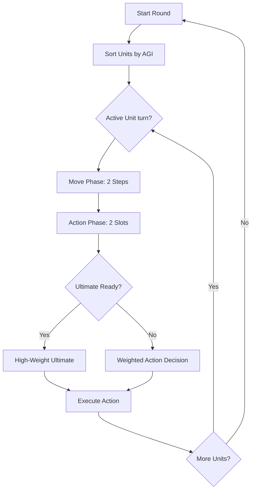

# Technical Design Document: Project Cryo

**Status:** Finalized (Unity Tactical Pivot)  
**Date:** 2026-02-16

## 1. Executive Summary
Project Cryo is a modular 2D RPG merging creature collection with tactical grid-based combat. This document outlines the technical architecture for the **Automated Tactical SRPG** system, leveraging Unity's ScriptableObject pattern and The Farming Engine's world state management.

## 2. System Architecture
The project follows a **Modular Component Architecture**, ensuring a clean separation between World exploration (The Farming Engine) and Tactical Combat (Custom SRPG Engine).

### 2.1 Core Modules
*   **World Engine (TFE)**: Handles top-down movement, farming, and data persistence.
*   **Tactical Grid Manager**: Manages the 5x5 battle arena, tile highlighting, and creature placement.
*   **Auto-Combat Controller**: A C# logic layer that drives automated creature turns using a weighted decision AI.
*   **Ultimate Meter System**: Tracks energy accumulation per creature and triggers Ultimate visual effects and logic.

## 3. Data Schema: ScriptableObjects
All static game data is managed via Unity's `ScriptableObject` system for designer-friendly iteration.

### 3.1 CreatureDefinition
```csharp
[CreateAssetMenu(fileName = "NewCreature", menuName = "Cryo/Creature")]
public class CreatureDefinition : ScriptableObject {
    public string creatureName;
    public Sprite artwork;
    public ElementType[] types;
    
    // Base Stats
    public int baseHP;
    public int baseATK;
    public int baseDEF;
    public int baseMAG; // Magic Attack
    public int baseMDEF; // Magic Defense
    public int baseAGI; // Speed (determines turn order)
    public int baseLUK; // Luck (biases AI and Crits)
    
    public List<ActionDefinition> autoActions;
    public ActionDefinition ultimateAction;
}
```

## 4. Tactical Combat Logic

### 4.1 Turn Economy
*   **Move Phase**: 2 moves per turn (1 tile per move).
*   **Action Phase**: 2 actions per turn (Standard Attack, Skill, or Ultimate).

### 4.2 The Luck Bias (AI & Crits)
The **Luck (LUK)** stat is the primary variable for procedural combat "flavor."
1.  **Critical Chance**: `5% + (LUK / 2)%`. Maxes at 55% for 100 LUK.
2.  **Accuracy Nudge**: On a miss, a unit rolls `Random(0, 100) < LUK / 4`. Success converts the miss to a "Lucky Hit."
3.  **Weighted AI Decision**:
    *   Actions are ranked with a Base Score.
    *   High-impact actions (e.g., executing a low-HP enemy) receive a bonus: `FinalScore = BaseScore * (1 + LUK/200)`.

### 4.3 Combat Loop Flow


## 5. Implementation Strategy
*   **World**: Inherit from `TheFarmingEngine.PlayerCharacter` for map movement.
*   **Transition**: Use a `BattleManager` singleton to freeze the world state and instantiate the tactical grid.
*   **UI**: Leverage **UI Toolkit** for the action queue display and damage numbers.

---
*Technical Lead: Antigravity*
